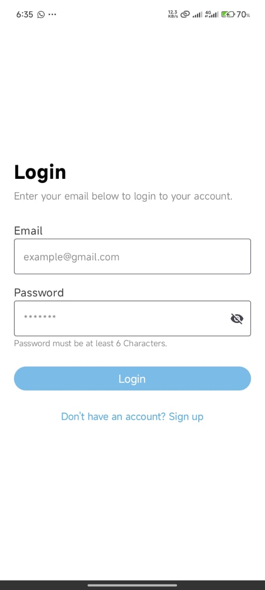
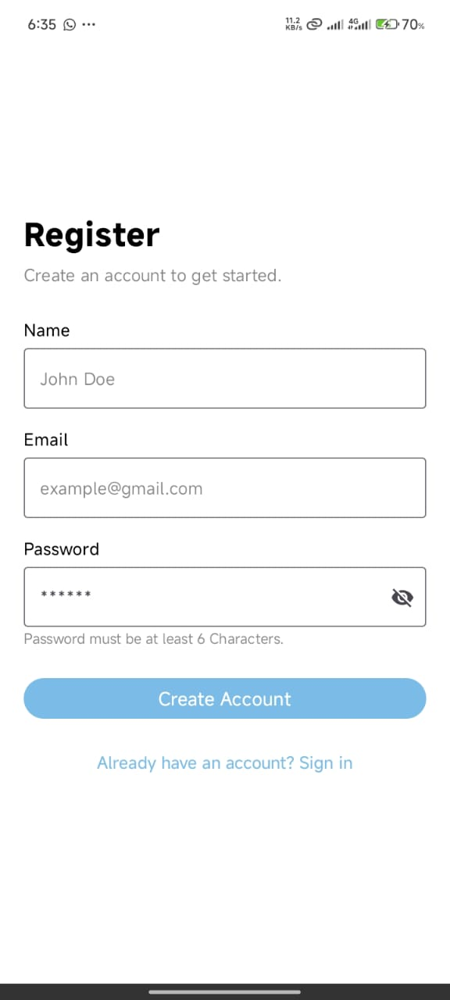
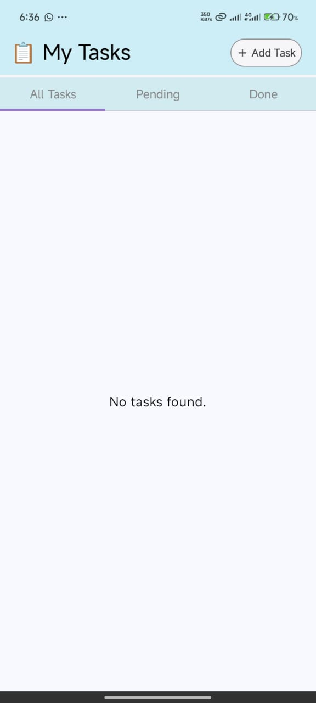
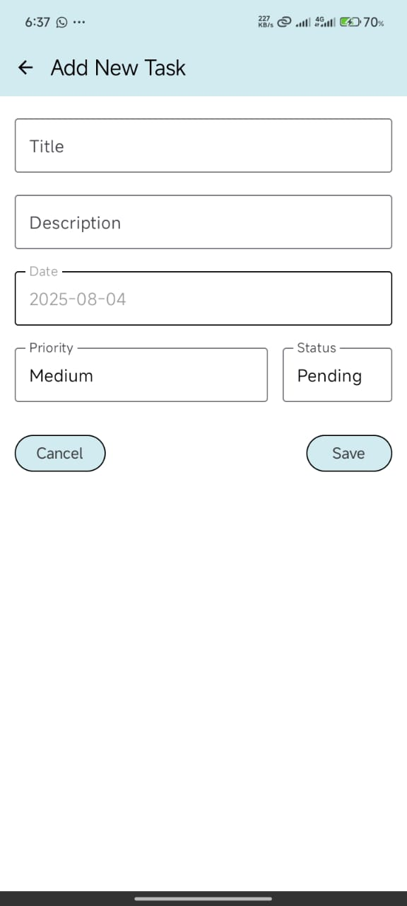
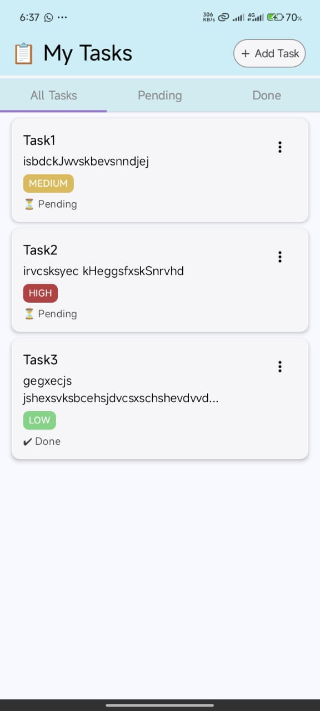

# TaskManagerApp 📋

## Objective
A modern Task Manager Android application built with **Jetpack Compose**, integrated with **Firebase Authentication** and **Firebase Realtime Database**. Users can **register**, **login**, and manage their personal tasks in a clean and intuitive interface.

---

## 🔥 Features

### ✅ User Authentication
- Register a new user with **Email & Password**
- Save user profile data (Name, Email) in **Firebase Realtime Database**
- Login existing users securely
- Display welcome message after login
- Record user's **last login timestamp**

### 📝 Task Management
- Add, view, edit, and delete tasks
- Tasks include **title**, **description**, **status**, **priority**, and **date**
- Categorized task tabs: `All`, `Pending`, `Done`
- MVVM Architecture using `ViewModel`, `LiveData`, and `Room` database

### 🔗 Firebase Integration
- Firebase Authentication (Email/Password)
- Firebase Realtime Database for storing user profiles and login info
- Displays user's name on task screen after login

### 🎨 UI & UX
- Built with **Jetpack Compose**
- Clean and responsive UI design
- Modern material design with custom colors, gradients, and intuitive navigation

---
## 🚀 How to Run the App

1. Clone the repository:
2. Open in Android Studio
3. Firebase Setup
- Create a Firebase Project on Firebase Console
- Enable Authentication > Email/Password
- Enable Realtime Database
- Download the google-services.json file and replace the one in app/ folder
4. Run the App
- Build and Run on Android Emulator or Physical Device

## ⚠️ Firebase Configuration Notice
This repository contains a google-services.json file meant for demo and testing purposes only.
- The linked Firebase project is not used in production
- No real user data is stored or processed
- Firebase billing is not enabled 
 * If you're cloning or reusing this app:
- Create your own Firebase project
- Enable Authentication and Realtime Database
- Download your own google-services.json file from Firebase Console
- Replace the existing file inside the app/ directory

## 📸 Screenshots

<h3>🏠 Login Screen</h3>  

<h3>📝 Register Screen</h3>  

<h3>🏁 Home Screen</h3>  

<h3>🏠 Add/Edit Screen</h3>  

<h3>📝 Tasks Screen</h3>  

